# Notification Service - Sequence Diagrams

> Visual documentation of all notification flows in the FCM Playground system.

---

## Table of Contents

1. [Device Registration](#1-device-registration)
2. [Send Notification (Topic-based)](#2-send-notification-topic-based)
3. [Send Notification (Token-based)](#3-send-notification-token-based)
4. [Remote Config Sync](#4-remote-config-sync)
5. [Scheduled Notification](#5-scheduled-notification)
6. [Topic Subscription Management](#6-topic-subscription-management)
7. [Action Button Handling](#7-action-button-handling)
8. [Silent Push (Background Update)](#8-silent-push-background-update)
9. [Batch Send](#9-batch-send)
10. [Dry Run Validation](#10-dry-run-validation)
11. [Template-based Notification](#11-template-based-notification)
12. [Complete End-to-End Flow](#12-complete-end-to-end-flow)
13. [Stale Token Management](#13-stale-token-management)
14. [FCM Error Handling](#14-fcm-error-handling)
15. [End-to-End Encryption](#15-end-to-end-encryption)
16. [Message Lifespan (TTL & Collapse Key)](#16-message-lifespan-ttl--collapse-key)
17. [Multicast Sending](#17-multicast-sending)
18. [Analytics & Delivery Tracking](#18-analytics--delivery-tracking)
19. [Server-side Throttling](#19-server-side-throttling)
20. [Android Notification Channels](#20-android-notification-channels)

---

## 1. Device Registration

**Flow**: Flutter app registers its FCM token with the server on startup.

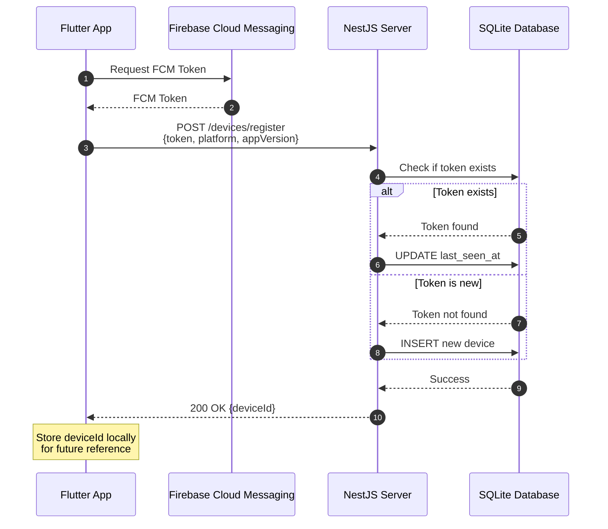
```mermaid
sequenceDiagram
    autonumber
    participant App as Flutter App
    participant FCM as Firebase Cloud Messaging
    participant Server as NestJS Server
    participant DB as SQLite Database

    App->>FCM: Request FCM Token
    FCM-->>App: FCM Token

    App->>Server: POST /devices/register<br/>{token, platform, appVersion}
    
    Server->>DB: Check if token exists
    
    alt Token exists
        DB-->>Server: Token found
        Server->>DB: UPDATE last_seen_at
    else Token is new
        DB-->>Server: Token not found
        Server->>DB: INSERT new device
    end
    
    DB-->>Server: Success
    Server-->>App: 200 OK {deviceId}
    
    Note over App: Store deviceId locally<br/>for future reference
```

---

## 2. Send Notification (Topic-based)

**Flow**: Web playground sends notification to all devices subscribed to specific topics.

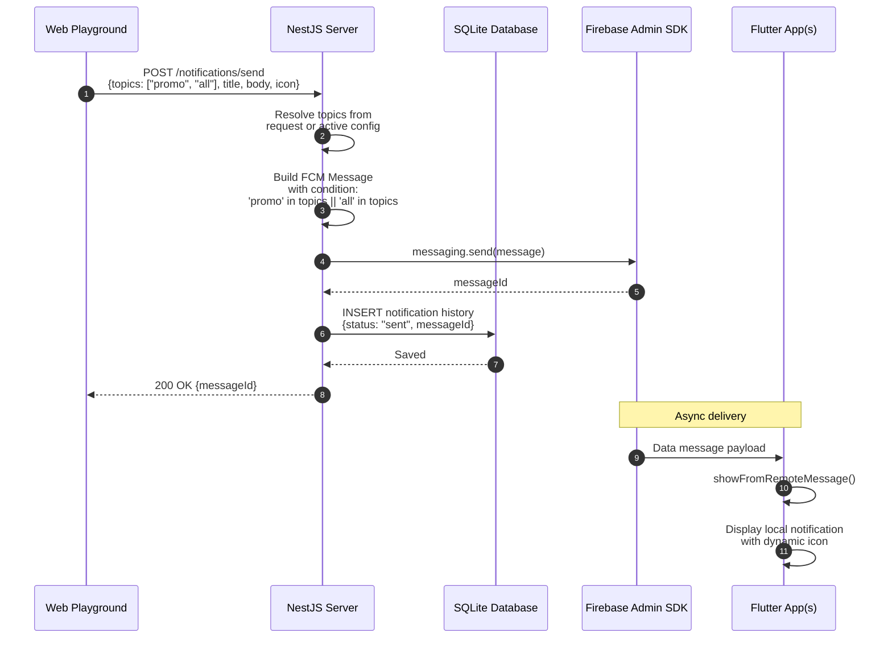
```mermaid
sequenceDiagram
    autonumber
    participant Web as Web Playground
    participant Server as NestJS Server
    participant DB as SQLite Database
    participant FCM as Firebase Admin SDK
    participant Device as Flutter App(s)

    Web->>Server: POST /notifications/send<br/>{topics: ["promo", "all"], title, body, icon}
    
    Server->>Server: Resolve topics from<br/>request or active config
    
    Server->>Server: Build FCM Message<br/>with condition:<br/>'promo' in topics || 'all' in topics
    
    Server->>FCM: messaging.send(message)
    
    FCM-->>Server: messageId
    
    Server->>DB: INSERT notification history<br/>{status: "sent", messageId}
    
    DB-->>Server: Saved
    Server-->>Web: 200 OK {messageId}
    
    Note over FCM,Device: Async delivery
    
    FCM->>Device: Data message payload
    Device->>Device: showFromRemoteMessage()
    Device->>Device: Display local notification<br/>with dynamic icon
```

---

## 3. Send Notification (Token-based)

**Flow**: Send notification directly to a specific device using its FCM token.

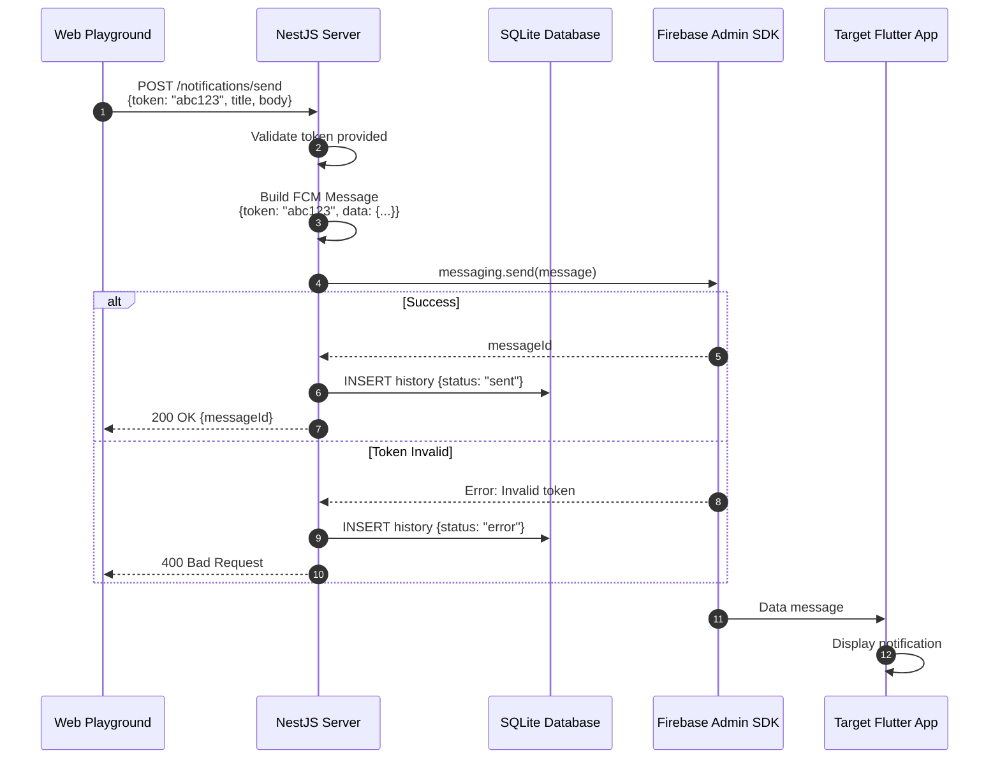
```mermaid
sequenceDiagram
    autonumber
    participant Web as Web Playground
    participant Server as NestJS Server
    participant DB as SQLite Database
    participant FCM as Firebase Admin SDK
    participant Device as Target Flutter App

    Web->>Server: POST /notifications/send<br/>{token: "abc123", title, body}
    
    Server->>Server: Validate token provided
    
    Server->>Server: Build FCM Message<br/>{token: "abc123", data: {...}}
    
    Server->>FCM: messaging.send(message)
    
    alt Success
        FCM-->>Server: messageId
        Server->>DB: INSERT history {status: "sent"}
        Server-->>Web: 200 OK {messageId}
    else Token Invalid
        FCM-->>Server: Error: Invalid token
        Server->>DB: INSERT history {status: "error"}
        Server-->>Web: 400 Bad Request
    end
    
    FCM->>Device: Data message
    Device->>Device: Display notification
```

---

## 4. Remote Config Sync

**Flow**: Flutter app fetches active config and subscribes to topics on startup.

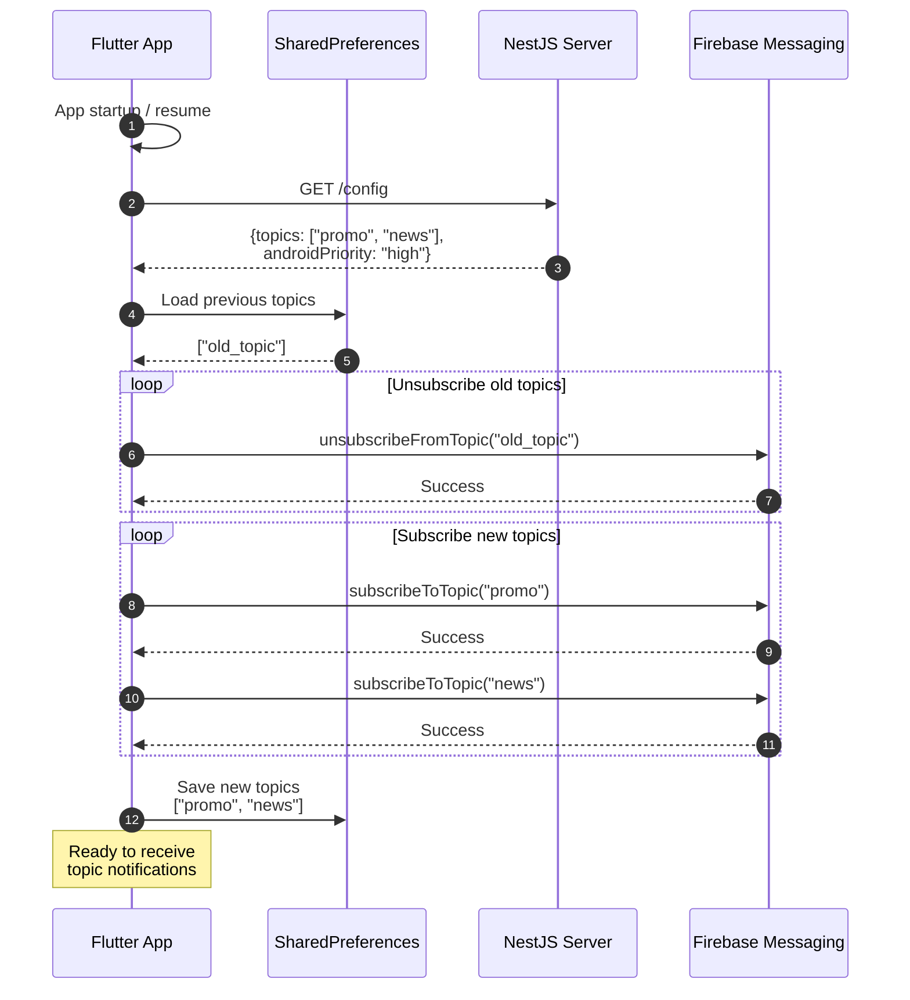
```mermaid
sequenceDiagram
    autonumber
    participant App as Flutter App
    participant Prefs as SharedPreferences
    participant Server as NestJS Server
    participant FCM as Firebase Messaging

    App->>App: App startup / resume
    
    App->>Server: GET /config
    Server-->>App: {topics: ["promo", "news"],<br/>androidPriority: "high"}
    
    App->>Prefs: Load previous topics
    Prefs-->>App: ["old_topic"]
    
    loop Unsubscribe old topics
        App->>FCM: unsubscribeFromTopic("old_topic")
        FCM-->>App: Success
    end
    
    loop Subscribe new topics
        App->>FCM: subscribeToTopic("promo")
        FCM-->>App: Success
        App->>FCM: subscribeToTopic("news")
        FCM-->>App: Success
    end
    
    App->>Prefs: Save new topics<br/>["promo", "news"]
    
    Note over App: Ready to receive<br/>topic notifications
```

---

## 5. Scheduled Notification

**Flow**: Create a scheduled notification that will be sent at a future time.

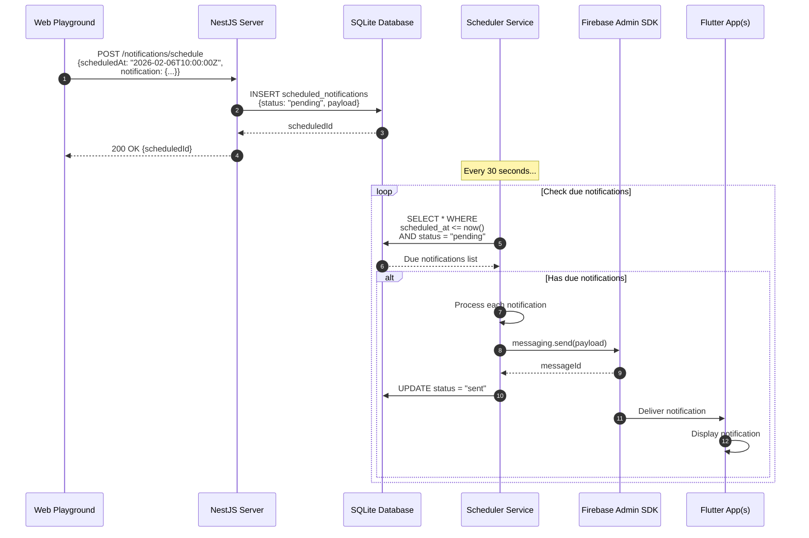
```mermaid
sequenceDiagram
    autonumber
    participant Web as Web Playground
    participant Server as NestJS Server
    participant DB as SQLite Database
    participant Cron as Scheduler Service
    participant FCM as Firebase Admin SDK
    participant Device as Flutter App(s)

    Web->>Server: POST /notifications/schedule<br/>{scheduledAt: "2026-02-06T10:00:00Z",<br/>notification: {...}}
    
    Server->>DB: INSERT scheduled_notifications<br/>{status: "pending", payload}
    
    DB-->>Server: scheduledId
    Server-->>Web: 200 OK {scheduledId}
    
    Note over Cron: Every 30 seconds...
    
    loop Check due notifications
        Cron->>DB: SELECT * WHERE<br/>scheduled_at <= now()<br/>AND status = "pending"
        
        DB-->>Cron: Due notifications list
        
        alt Has due notifications
            Cron->>Cron: Process each notification
            Cron->>FCM: messaging.send(payload)
            FCM-->>Cron: messageId
            Cron->>DB: UPDATE status = "sent"
            
            FCM->>Device: Deliver notification
            Device->>Device: Display notification
        end
    end
```

---

## 6. Topic Subscription Management

**Flow**: Server-side topic subscription management via Firebase Admin SDK.

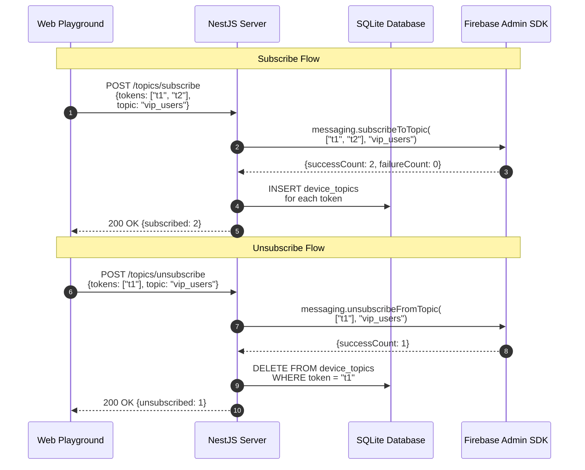
```mermaid
sequenceDiagram
    autonumber
    participant Web as Web Playground
    participant Server as NestJS Server
    participant DB as SQLite Database
    participant FCM as Firebase Admin SDK

    Note over Web,FCM: Subscribe Flow
    
    Web->>Server: POST /topics/subscribe<br/>{tokens: ["t1", "t2"],<br/>topic: "vip_users"}
    
    Server->>FCM: messaging.subscribeToTopic(<br/>["t1", "t2"], "vip_users")
    
    FCM-->>Server: {successCount: 2, failureCount: 0}
    
    Server->>DB: INSERT device_topics<br/>for each token
    
    Server-->>Web: 200 OK {subscribed: 2}
    
    Note over Web,FCM: Unsubscribe Flow
    
    Web->>Server: POST /topics/unsubscribe<br/>{tokens: ["t1"], topic: "vip_users"}
    
    Server->>FCM: messaging.unsubscribeFromTopic(<br/>["t1"], "vip_users")
    
    FCM-->>Server: {successCount: 1}
    
    Server->>DB: DELETE FROM device_topics<br/>WHERE token = "t1"
    
    Server-->>Web: 200 OK {unsubscribed: 1}
```

---

## 7. Action Button Handling

**Flow**: Notification with action buttons and user interaction handling.

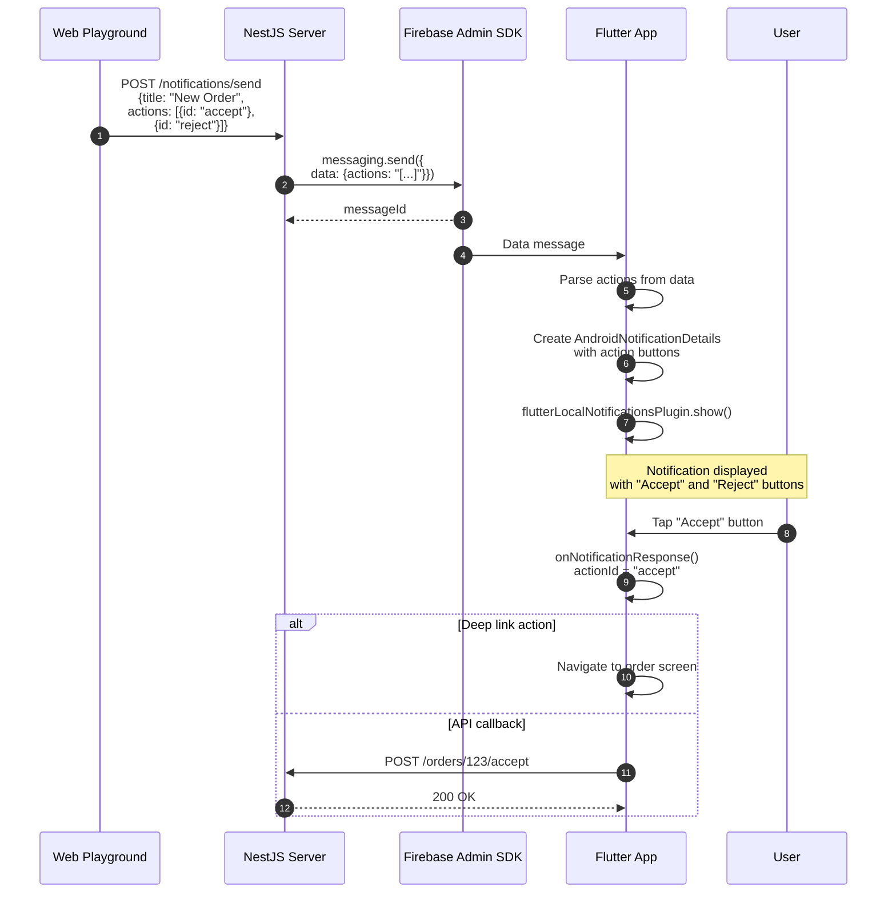
```mermaid
sequenceDiagram
    autonumber
    participant Web as Web Playground
    participant Server as NestJS Server
    participant FCM as Firebase Admin SDK
    participant Device as Flutter App
    participant User as User

    Web->>Server: POST /notifications/send<br/>{title: "New Order",<br/>actions: [{id: "accept"},<br/>{id: "reject"}]}
    
    Server->>FCM: messaging.send({<br/>data: {actions: "[...]"}})
    
    FCM-->>Server: messageId
    FCM->>Device: Data message
    
    Device->>Device: Parse actions from data
    Device->>Device: Create AndroidNotificationDetails<br/>with action buttons
    Device->>Device: flutterLocalNotificationsPlugin.show()
    
    Note over Device,User: Notification displayed<br/>with "Accept" and "Reject" buttons
    
    User->>Device: Tap "Accept" button
    
    Device->>Device: onNotificationResponse()<br/>actionId = "accept"
    
    alt Deep link action
        Device->>Device: Navigate to order screen
    else API callback
        Device->>Server: POST /orders/123/accept
        Server-->>Device: 200 OK
    end
```

---

## 8. Silent Push (Background Update)

**Flow**: Silent notification for background data sync without user-visible notification.

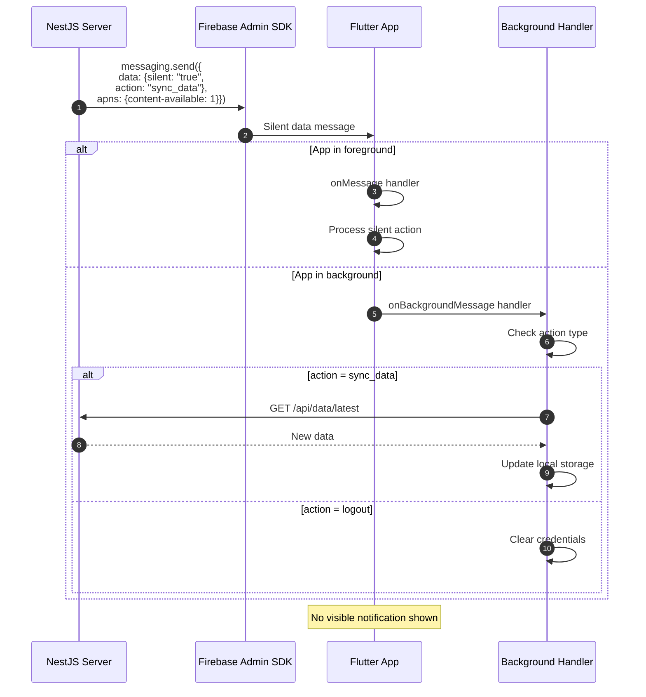
```mermaid
sequenceDiagram
    autonumber
    participant Server as NestJS Server
    participant FCM as Firebase Admin SDK
    participant Device as Flutter App
    participant BG as Background Handler

    Server->>FCM: messaging.send({<br/>data: {silent: "true",<br/>action: "sync_data"},<br/>apns: {content-available: 1}})
    
    FCM->>Device: Silent data message
    
    alt App in foreground
        Device->>Device: onMessage handler
        Device->>Device: Process silent action
    else App in background
        Device->>BG: onBackgroundMessage handler
        BG->>BG: Check action type
        
        alt action = sync_data
            BG->>Server: GET /api/data/latest
            Server-->>BG: New data
            BG->>BG: Update local storage
        else action = logout
            BG->>BG: Clear credentials
        end
    end
    
    Note over Device: No visible notification shown
```

---

## 9. Batch Send

**Flow**: Send notifications to multiple tokens in a single API call.

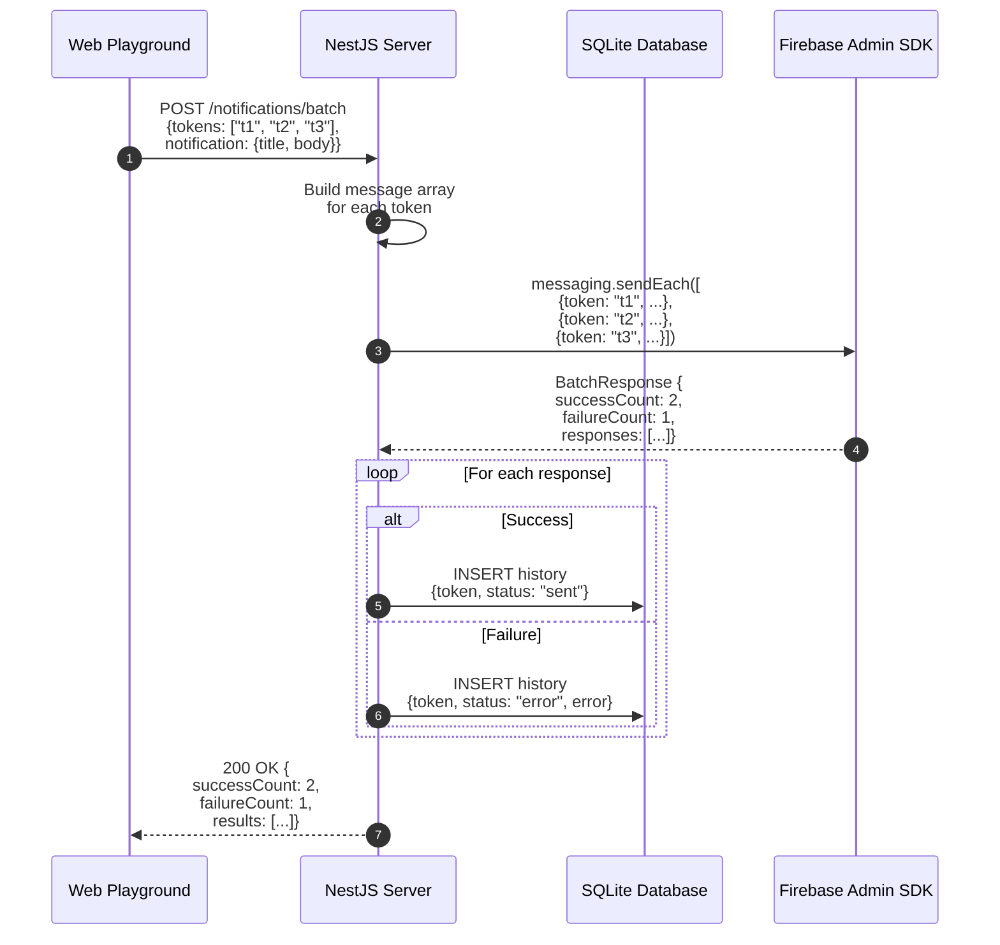
```mermaid
sequenceDiagram
    autonumber
    participant Web as Web Playground
    participant Server as NestJS Server
    participant DB as SQLite Database
    participant FCM as Firebase Admin SDK

    Web->>Server: POST /notifications/batch<br/>{tokens: ["t1", "t2", "t3"],<br/>notification: {title, body}}
    
    Server->>Server: Build message array<br/>for each token
    
    Server->>FCM: messaging.sendEach([<br/>{token: "t1", ...},<br/>{token: "t2", ...},<br/>{token: "t3", ...}])
    
    FCM-->>Server: BatchResponse {<br/>successCount: 2,<br/>failureCount: 1,<br/>responses: [...]}
    
    loop For each response
        alt Success
            Server->>DB: INSERT history<br/>{token, status: "sent"}
        else Failure
            Server->>DB: INSERT history<br/>{token, status: "error", error}
        end
    end
    
    Server-->>Web: 200 OK {<br/>successCount: 2,<br/>failureCount: 1,<br/>results: [...]}
```

---

## 10. Dry Run Validation

**Flow**: Validate notification payload without actually sending.

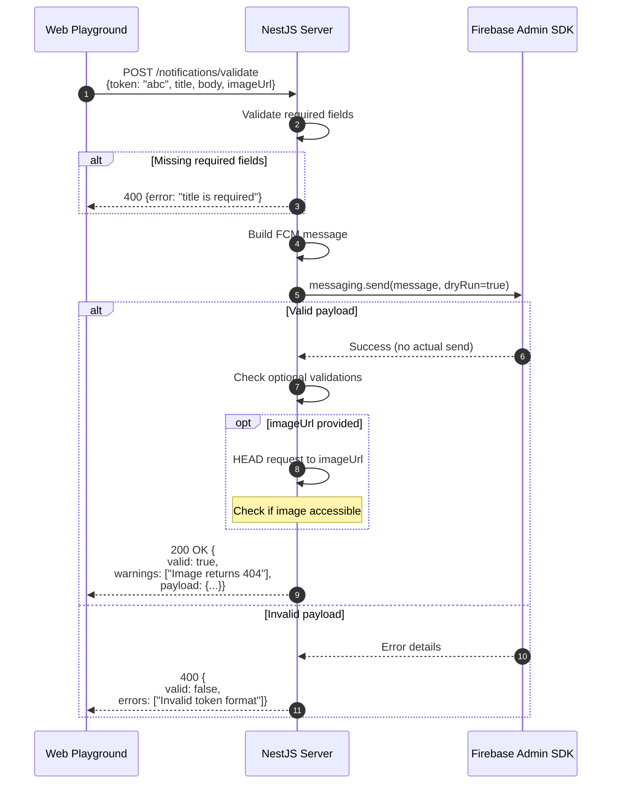
```mermaid
sequenceDiagram
    autonumber
    participant Web as Web Playground
    participant Server as NestJS Server
    participant FCM as Firebase Admin SDK

    Web->>Server: POST /notifications/validate<br/>{token: "abc", title, body, imageUrl}
    
    Server->>Server: Validate required fields
    
    alt Missing required fields
        Server-->>Web: 400 {error: "title is required"}
    end
    
    Server->>Server: Build FCM message
    
    Server->>FCM: messaging.send(message, dryRun=true)
    
    alt Valid payload
        FCM-->>Server: Success (no actual send)
        
        Server->>Server: Check optional validations
        
        opt imageUrl provided
            Server->>Server: HEAD request to imageUrl
            Note over Server: Check if image accessible
        end
        
        Server-->>Web: 200 OK {<br/>valid: true,<br/>warnings: ["Image returns 404"],<br/>payload: {...}}
    else Invalid payload
        FCM-->>Server: Error details
        Server-->>Web: 400 {<br/>valid: false,<br/>errors: ["Invalid token format"]}
    end
```

---

## 11. Template-based Notification

**Flow**: Save, load, and send notifications using predefined templates.

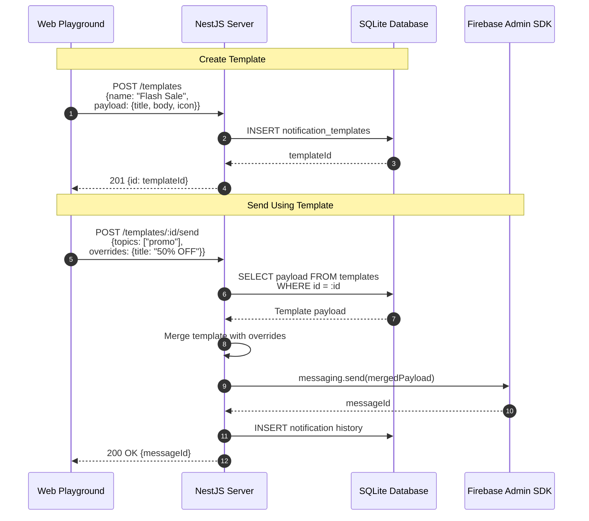
```mermaid
sequenceDiagram
    autonumber
    participant Web as Web Playground
    participant Server as NestJS Server
    participant DB as SQLite Database
    participant FCM as Firebase Admin SDK

    Note over Web,DB: Create Template
    
    Web->>Server: POST /templates<br/>{name: "Flash Sale",<br/>payload: {title, body, icon}}
    
    Server->>DB: INSERT notification_templates
    DB-->>Server: templateId
    Server-->>Web: 201 {id: templateId}
    
    Note over Web,FCM: Send Using Template
    
    Web->>Server: POST /templates/:id/send<br/>{topics: ["promo"],<br/>overrides: {title: "50% OFF"}}
    
    Server->>DB: SELECT payload FROM templates<br/>WHERE id = :id
    
    DB-->>Server: Template payload
    
    Server->>Server: Merge template with overrides
    
    Server->>FCM: messaging.send(mergedPayload)
    FCM-->>Server: messageId
    
    Server->>DB: INSERT notification history
    Server-->>Web: 200 OK {messageId}
```

---

## 12. Complete End-to-End Flow

**Flow**: Full journey from web UI to notification displayed on device.

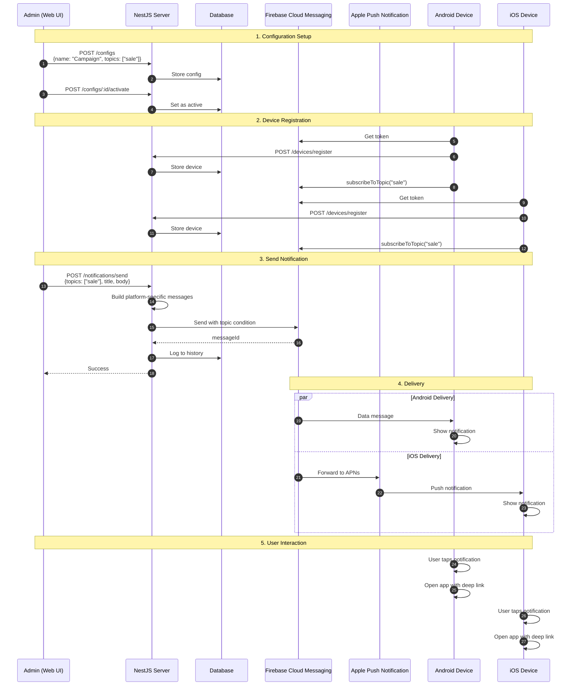
```mermaid
sequenceDiagram
    autonumber
    participant Admin as Admin (Web UI)
    participant Server as NestJS Server
    participant DB as Database
    participant FCM as Firebase Cloud Messaging
    participant APNs as Apple Push Notification
    participant Android as Android Device
    participant iOS as iOS Device

    Note over Admin,iOS: 1. Configuration Setup
    
    Admin->>Server: POST /configs<br/>{name: "Campaign", topics: ["sale"]}
    Server->>DB: Store config
    Admin->>Server: POST /configs/:id/activate
    Server->>DB: Set as active
    
    Note over Admin,iOS: 2. Device Registration
    
    Android->>FCM: Get token
    Android->>Server: POST /devices/register
    Server->>DB: Store device
    Android->>FCM: subscribeToTopic("sale")
    
    iOS->>FCM: Get token
    iOS->>Server: POST /devices/register
    Server->>DB: Store device
    iOS->>FCM: subscribeToTopic("sale")
    
    Note over Admin,iOS: 3. Send Notification
    
    Admin->>Server: POST /notifications/send<br/>{topics: ["sale"], title, body}
    
    Server->>Server: Build platform-specific messages
    Server->>FCM: Send with topic condition
    FCM-->>Server: messageId
    Server->>DB: Log to history
    Server-->>Admin: Success
    
    Note over FCM,iOS: 4. Delivery
    
    par Android Delivery
        FCM->>Android: Data message
        Android->>Android: Show notification
    and iOS Delivery
        FCM->>APNs: Forward to APNs
        APNs->>iOS: Push notification
        iOS->>iOS: Show notification
    end
    
    Note over Admin,iOS: 5. User Interaction
    
    Android->>Android: User taps notification
    Android->>Android: Open app with deep link
    
    iOS->>iOS: User taps notification
    iOS->>iOS: Open app with deep link
```

---

## 13. Stale Token Management

**Flow**: Manage stale and expired FCM registration tokens following Firebase best practices.

> **Reference**: [Firebase FCM Token Management Best Practices](https://firebase.google.com/docs/cloud-messaging/manage-tokens)

### 13.1 Token Freshness Check (Periodic Job)

**Flow**: Daily cron job to identify and remove stale tokens (inactive > 30 days).

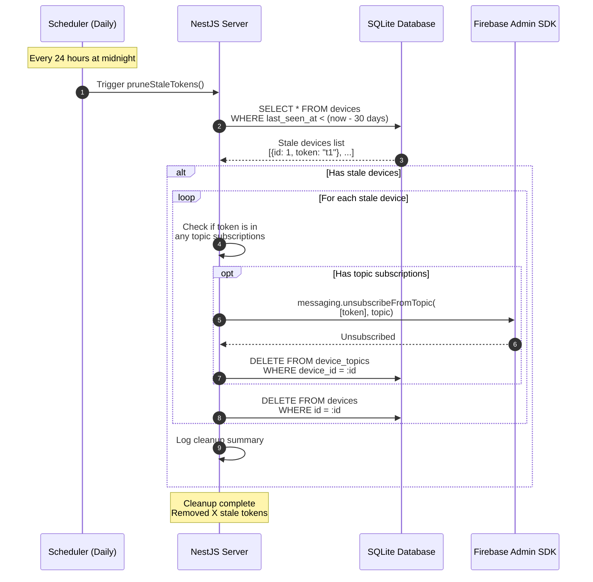
```mermaid
sequenceDiagram
    autonumber
    participant Cron as Scheduler (Daily)
    participant Server as NestJS Server
    participant DB as SQLite Database
    participant FCM as Firebase Admin SDK

    Note over Cron: Every 24 hours at midnight

    Cron->>Server: Trigger pruneStaleTokens()
    
    Server->>DB: SELECT * FROM devices<br/>WHERE last_seen_at < (now - 30 days)
    
    DB-->>Server: Stale devices list<br/>[{id: 1, token: "t1"}, ...]
    
    alt Has stale devices
        loop For each stale device
            Server->>Server: Check if token is in<br/>any topic subscriptions
            
            opt Has topic subscriptions
                Server->>FCM: messaging.unsubscribeFromTopic(<br/>[token], topic)
                FCM-->>Server: Unsubscribed
                Server->>DB: DELETE FROM device_topics<br/>WHERE device_id = :id
            end
            
            Server->>DB: DELETE FROM devices<br/>WHERE id = :id
        end
        
        Server->>Server: Log cleanup summary
    end
    
    Note over Server: Cleanup complete<br/>Removed X stale tokens
```

---

### 13.2 Token Refresh on App Open

**Flow**: Flutter app refreshes token and updates server timestamp on each app open.

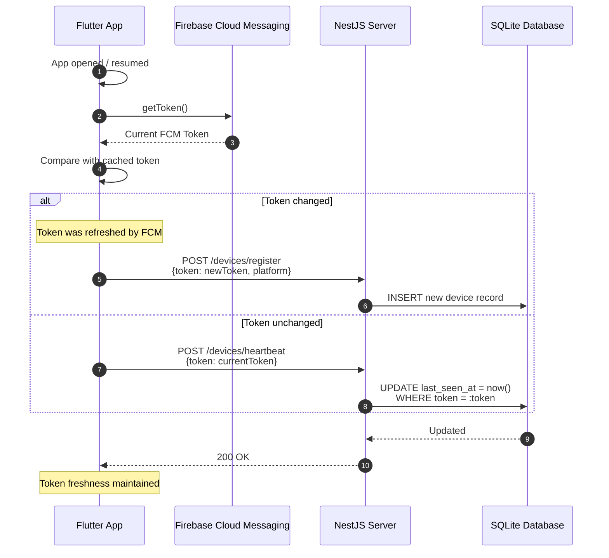
```mermaid
sequenceDiagram
    autonumber
    participant App as Flutter App
    participant FCM as Firebase Cloud Messaging
    participant Server as NestJS Server
    participant DB as SQLite Database

    App->>App: App opened / resumed
    
    App->>FCM: getToken()
    FCM-->>App: Current FCM Token
    
    App->>App: Compare with cached token
    
    alt Token changed
        Note over App: Token was refreshed by FCM
        App->>Server: POST /devices/register<br/>{token: newToken, platform}
        Server->>DB: INSERT new device record
    else Token unchanged
        App->>Server: POST /devices/heartbeat<br/>{token: currentToken}
        Server->>DB: UPDATE last_seen_at = now()<br/>WHERE token = :token
    end
    
    DB-->>Server: Updated
    Server-->>App: 200 OK
    
    Note over App: Token freshness maintained
```

---

### 13.3 Handle Token Refresh Callback

**Flow**: Listen for token refresh events from FCM SDK.

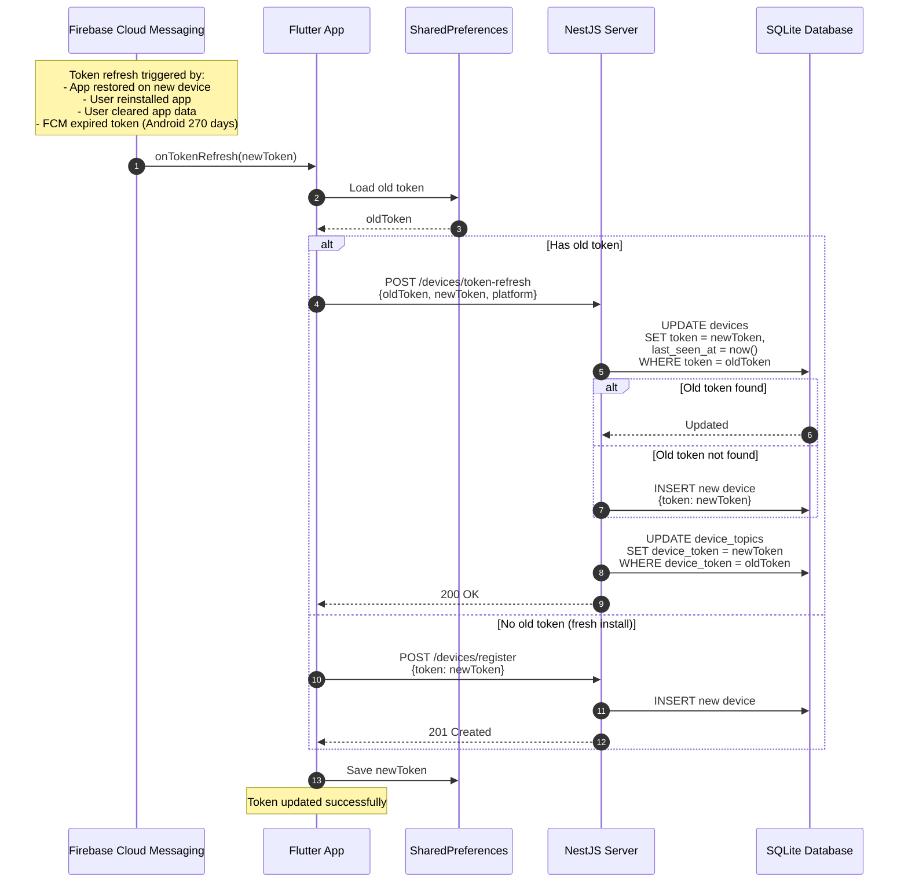
```mermaid
sequenceDiagram
    autonumber
    participant FCM as Firebase Cloud Messaging
    participant App as Flutter App
    participant Prefs as SharedPreferences
    participant Server as NestJS Server
    participant DB as SQLite Database

    Note over FCM: Token refresh triggered by:<br/>- App restored on new device<br/>- User reinstalled app<br/>- User cleared app data<br/>- FCM expired token (Android 270 days)
    
    FCM->>App: onTokenRefresh(newToken)
    
    App->>Prefs: Load old token
    Prefs-->>App: oldToken
    
    alt Has old token
        App->>Server: POST /devices/token-refresh<br/>{oldToken, newToken, platform}
        
        Server->>DB: UPDATE devices<br/>SET token = newToken,<br/>last_seen_at = now()<br/>WHERE token = oldToken
        
        alt Old token found
            DB-->>Server: Updated
        else Old token not found
            Server->>DB: INSERT new device<br/>{token: newToken}
        end
        
        Server->>DB: UPDATE device_topics<br/>SET device_token = newToken<br/>WHERE device_token = oldToken
        
        Server-->>App: 200 OK
    else No old token (fresh install)
        App->>Server: POST /devices/register<br/>{token: newToken}
        Server->>DB: INSERT new device
        Server-->>App: 201 Created
    end
    
    App->>Prefs: Save newToken
    
    Note over App: Token updated successfully
```

---

### 13.4 Stale Token Detection on Send Failure

**Flow**: Detect and remove invalid tokens when FCM returns UNREGISTERED error.

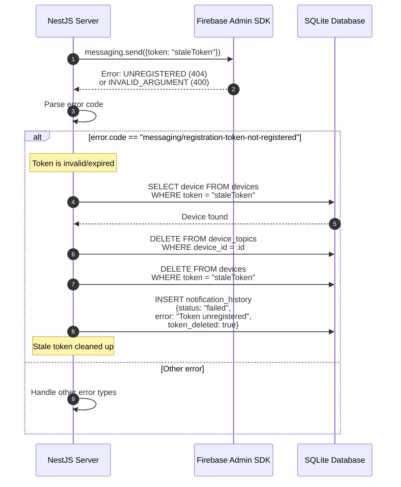
```mermaid
sequenceDiagram
    autonumber
    participant Server as NestJS Server
    participant FCM as Firebase Admin SDK
    participant DB as SQLite Database

    Server->>FCM: messaging.send({token: "staleToken"})
    
    FCM-->>Server: Error: UNREGISTERED (404)<br/>or INVALID_ARGUMENT (400)
    
    Server->>Server: Parse error code
    
    alt error.code == "messaging/registration-token-not-registered"
        Note over Server: Token is invalid/expired
        
        Server->>DB: SELECT device FROM devices<br/>WHERE token = "staleToken"
        DB-->>Server: Device found
        
        Server->>DB: DELETE FROM device_topics<br/>WHERE device_id = :id
        
        Server->>DB: DELETE FROM devices<br/>WHERE token = "staleToken"
        
        Server->>DB: INSERT notification_history<br/>{status: "failed",<br/>error: "Token unregistered",<br/>token_deleted: true}
        
        Note over Server: Stale token cleaned up
    else Other error
        Server->>Server: Handle other error types
    end
```

---

## 14. FCM Error Handling

**Flow**: Comprehensive error handling for all FCM error codes with appropriate recovery actions.

> **Reference**: [FCM Error Codes Documentation](https://firebase.google.com/docs/cloud-messaging/error-codes)

### 14.1 Error Classification and Handling

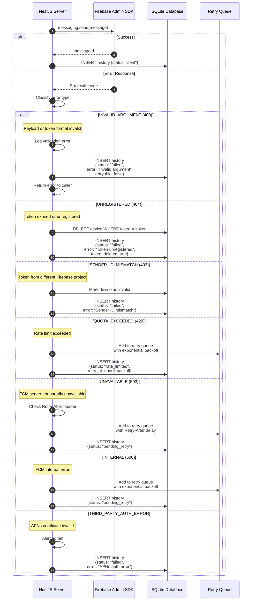
```mermaid
sequenceDiagram
    autonumber
    participant Server as NestJS Server
    participant FCM as Firebase Admin SDK
    participant DB as SQLite Database
    participant Queue as Retry Queue

    Server->>FCM: messaging.send(message)
    
    alt Success
        FCM-->>Server: messageId
        Server->>DB: INSERT history {status: "sent"}
    else Error Response
        FCM-->>Server: Error with code
        
        Server->>Server: Classify error type
        
        alt INVALID_ARGUMENT (400)
            Note over Server: Payload or token format invalid
            Server->>Server: Log validation error
            Server->>DB: INSERT history<br/>{status: "failed",<br/>error: "Invalid argument",<br/>retryable: false}
            Server-->>Server: Return error to caller
            
        else UNREGISTERED (404)
            Note over Server: Token expired or unregistered
            Server->>DB: DELETE device WHERE token = :token
            Server->>DB: INSERT history<br/>{status: "failed",<br/>error: "Token unregistered",<br/>token_deleted: true}
            
        else SENDER_ID_MISMATCH (403)
            Note over Server: Token from different Firebase project
            Server->>DB: Mark device as invalid
            Server->>DB: INSERT history<br/>{status: "failed",<br/>error: "Sender ID mismatch"}
            
        else QUOTA_EXCEEDED (429)
            Note over Server: Rate limit exceeded
            Server->>Queue: Add to retry queue<br/>with exponential backoff
            Server->>DB: INSERT history<br/>{status: "rate_limited",<br/>retry_at: now + backoff}
            
        else UNAVAILABLE (503)
            Note over Server: FCM server temporarily unavailable
            Server->>Server: Check Retry-After header
            Server->>Queue: Add to retry queue<br/>with Retry-After delay
            Server->>DB: INSERT history<br/>{status: "pending_retry"}
            
        else INTERNAL (500)
            Note over Server: FCM internal error
            Server->>Queue: Add to retry queue<br/>with exponential backoff
            Server->>DB: INSERT history<br/>{status: "pending_retry"}
            
        else THIRD_PARTY_AUTH_ERROR
            Note over Server: APNs certificate invalid
            Server->>Server: Alert admin
            Server->>DB: INSERT history<br/>{status: "failed",<br/>error: "APNs auth error"}
        end
    end
```

---

### 14.2 Retry Queue with Exponential Backoff

**Flow**: Handle retryable errors with exponential backoff strategy.

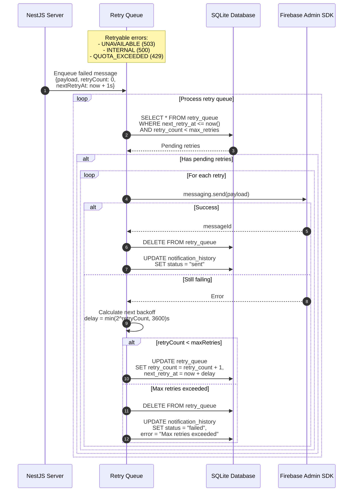
```mermaid
sequenceDiagram
    autonumber
    participant Server as NestJS Server
    participant Queue as Retry Queue
    participant DB as SQLite Database
    participant FCM as Firebase Admin SDK

    Note over Queue: Retryable errors:<br/>- UNAVAILABLE (503)<br/>- INTERNAL (500)<br/>- QUOTA_EXCEEDED (429)
    
    Server->>Queue: Enqueue failed message<br/>{payload, retryCount: 0,<br/>nextRetryAt: now + 1s}
    
    loop Process retry queue
        Queue->>DB: SELECT * FROM retry_queue<br/>WHERE next_retry_at <= now()<br/>AND retry_count < max_retries
        
        DB-->>Queue: Pending retries
        
        alt Has pending retries
            loop For each retry
                Queue->>FCM: messaging.send(payload)
                
                alt Success
                    FCM-->>Queue: messageId
                    Queue->>DB: DELETE FROM retry_queue
                    Queue->>DB: UPDATE notification_history<br/>SET status = "sent"
                    
                else Still failing
                    FCM-->>Queue: Error
                    Queue->>Queue: Calculate next backoff<br/>delay = min(2^retryCount, 3600)s
                    
                    alt retryCount < maxRetries
                        Queue->>DB: UPDATE retry_queue<br/>SET retry_count = retry_count + 1,<br/>next_retry_at = now + delay
                    else Max retries exceeded
                        Queue->>DB: DELETE FROM retry_queue
                        Queue->>DB: UPDATE notification_history<br/>SET status = "failed",<br/>error = "Max retries exceeded"
                    end
                end
            end
        end
    end
```

---

### 14.3 Batch Send Error Handling

**Flow**: Handle errors in batch send operations with per-token error tracking.

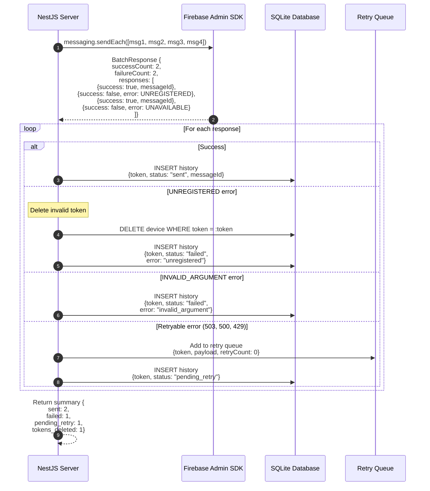
```mermaid
sequenceDiagram
    autonumber
    participant Server as NestJS Server
    participant FCM as Firebase Admin SDK
    participant DB as SQLite Database
    participant Queue as Retry Queue

    Server->>FCM: messaging.sendEach([msg1, msg2, msg3, msg4])
    
    FCM-->>Server: BatchResponse {<br/>successCount: 2,<br/>failureCount: 2,<br/>responses: [<br/>{success: true, messageId},<br/>{success: false, error: UNREGISTERED},<br/>{success: true, messageId},<br/>{success: false, error: UNAVAILABLE}<br/>]}
    
    loop For each response
        alt Success
            Server->>DB: INSERT history<br/>{token, status: "sent", messageId}
            
        else UNREGISTERED error
            Note over Server: Delete invalid token
            Server->>DB: DELETE device WHERE token = :token
            Server->>DB: INSERT history<br/>{token, status: "failed",<br/>error: "unregistered"}
            
        else INVALID_ARGUMENT error
            Server->>DB: INSERT history<br/>{token, status: "failed",<br/>error: "invalid_argument"}
            
        else Retryable error (503, 500, 429)
            Server->>Queue: Add to retry queue<br/>{token, payload, retryCount: 0}
            Server->>DB: INSERT history<br/>{token, status: "pending_retry"}
        end
    end
    
    Server-->>Server: Return summary {<br/>sent: 2,<br/>failed: 1,<br/>pending_retry: 1,<br/>tokens_deleted: 1}
```

---

### 14.4 FCM Error Codes Reference

| Error Code | HTTP Status | Admin SDK Code | Action | Retryable |
|------------|-------------|----------------|--------|-----------|
| `INVALID_ARGUMENT` | 400 | `messaging/invalid-argument` | Fix payload format | ❌ No |
| `UNREGISTERED` | 404 | `messaging/registration-token-not-registered` | Delete token from DB | ❌ No |
| `SENDER_ID_MISMATCH` | 403 | `messaging/mismatched-credential` | Check Firebase project | ❌ No |
| `QUOTA_EXCEEDED` | 429 | `messaging/message-rate-exceeded` | Exponential backoff | ✅ Yes |
| `UNAVAILABLE` | 503 | `messaging/server-unavailable` | Retry with backoff | ✅ Yes |
| `INTERNAL` | 500 | `messaging/internal-error` | Retry with backoff | ✅ Yes |
| `THIRD_PARTY_AUTH_ERROR` | 401 | `messaging/invalid-apns-credentials` | Fix APNs certificate | ❌ No |

---

### 14.5 Error Handling Service Implementation

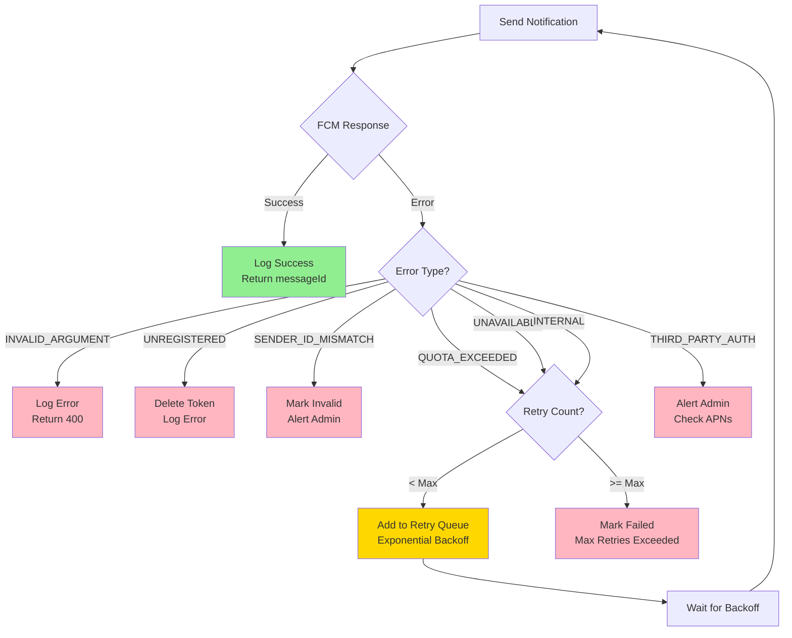
```mermaid
flowchart TD
    A[Send Notification] --> B{FCM Response}
    
    B -->|Success| C[Log Success<br/>Return messageId]
    B -->|Error| D{Error Type?}
    
    D -->|INVALID_ARGUMENT| E[Log Error<br/>Return 400]
    D -->|UNREGISTERED| F[Delete Token<br/>Log Error]
    D -->|SENDER_ID_MISMATCH| G[Mark Invalid<br/>Alert Admin]
    D -->|QUOTA_EXCEEDED| H{Retry Count?}
    D -->|UNAVAILABLE| H
    D -->|INTERNAL| H
    D -->|THIRD_PARTY_AUTH| I[Alert Admin<br/>Check APNs]
    
    H -->|< Max| J[Add to Retry Queue<br/>Exponential Backoff]
    H -->|>= Max| K[Mark Failed<br/>Max Retries Exceeded]
    
    J --> L[Wait for Backoff]
    L --> A
    
    style C fill:#90EE90
    style E fill:#FFB6C1
    style F fill:#FFB6C1
    style G fill:#FFB6C1
    style I fill:#FFB6C1
    style K fill:#FFB6C1
    style J fill:#FFD700
```

---

## 15. End-to-End Encryption

**Flow**: Secure sensitive message data with end-to-end encryption for FCM data messages.

> **Reference**: [Firebase E2E Encryption Documentation](https://firebase.google.com/docs/cloud-messaging/encryption)

> [!IMPORTANT]
> FCM does not provide built-in E2E encryption. You must implement this security layer using external libraries like [Capillary](https://android-developers.googleblog.com/2018/06/project-capillary-end-to-end-encryption.html) or standard protocols like RSA/AES.

### 15.1 Key Exchange (Device Registration)

**Flow**: Exchange public keys during device registration for asymmetric encryption.

```mermaid
sequenceDiagram
    autonumber
    participant App as Flutter App
    participant KeyStore as Secure KeyStore
    participant Server as NestJS Server
    participant DB as SQLite Database

    Note over App: First app launch or<br/>key rotation required
    
    App->>App: Generate RSA key pair<br/>(2048-bit or higher)
    
    App->>KeyStore: Store private key securely<br/>(Android Keystore / iOS Keychain)
    KeyStore-->>App: Stored
    
    App->>App: Export public key<br/>(Base64 encoded)
    
    App->>Server: POST /devices/register<br/>{token, platform,<br/>publicKey: "MIIBIj..."}
    
    Server->>DB: INSERT device<br/>{token, platform, public_key}
    
    DB-->>Server: deviceId
    
    Server->>Server: Generate server key pair<br/>(for bidirectional encryption)
    
    Server-->>App: 200 OK {<br/>deviceId,<br/>serverPublicKey: "MIIBIj..."}
    
    App->>KeyStore: Store server public key
    
    Note over App,Server: Key exchange complete<br/>Ready for E2E encryption
```

---

### 15.2 Send Encrypted Notification

**Flow**: Server encrypts sensitive data before sending via FCM.

```mermaid
sequenceDiagram
    autonumber
    participant Admin as Admin (Web UI)
    participant Server as NestJS Server
    participant DB as SQLite Database
    participant Crypto as Crypto Service
    participant FCM as Firebase Admin SDK
    participant Device as Flutter App

    Admin->>Server: POST /notifications/send<br/>{token: "abc",<br/>title: "2FA Code",<br/>body: "Your code is 555-123",<br/>encrypted: true}
    
    Server->>Server: Check if encrypted: true
    
    Server->>DB: SELECT public_key<br/>FROM devices<br/>WHERE token = "abc"
    
    DB-->>Server: Device public key
    
    alt Has public key
        Server->>Crypto: Encrypt payload with<br/>device's public key
        
        Note over Crypto: 1. Generate AES session key<br/>2. Encrypt payload with AES<br/>3. Encrypt AES key with RSA<br/>4. Combine as encrypted_payload
        
        Crypto-->>Server: {<br/>encrypted_payload: "aG9va2Vk...",<br/>encrypted_key: "xY7zK9...",<br/>iv: "abc123..."}
        
        Server->>FCM: messaging.send({<br/>token: "abc",<br/>data: {<br/>encrypted: "true",<br/>encrypted_payload: "...",<br/>encrypted_key: "...",<br/>iv: "..."}})
        
        FCM-->>Server: messageId
        Server->>DB: INSERT history<br/>{status: "sent", encrypted: true}
        Server-->>Admin: 200 OK {messageId}
        
    else No public key
        Server-->>Admin: 400 Error:<br/>Device not registered for E2E
    end
    
    Note over FCM,Device: Encrypted payload transmitted
    
    FCM->>Device: Data message with<br/>encrypted payload
```

---

### 15.3 Client Decryption

**Flow**: Flutter app decrypts the received encrypted notification.

```mermaid
sequenceDiagram
    autonumber
    participant FCM as Firebase Messaging
    participant App as Flutter App
    participant KeyStore as Secure KeyStore
    participant Crypto as Crypto Service
    participant UI as Notification UI

    FCM->>App: onMessage / onBackgroundMessage<br/>{data: {encrypted: "true",<br/>encrypted_payload: "...",<br/>encrypted_key: "...",<br/>iv: "..."}}
    
    App->>App: Check if data.encrypted == "true"
    
    alt Is encrypted
        App->>KeyStore: Retrieve private key
        KeyStore-->>App: RSA Private Key
        
        App->>Crypto: Decrypt AES key<br/>using RSA private key
        
        Crypto-->>App: AES session key
        
        App->>Crypto: Decrypt payload<br/>using AES key + IV
        
        Crypto-->>App: Decrypted payload<br/>{title: "2FA Code",<br/>body: "Your code is 555-123"}
        
        App->>UI: Display notification<br/>with decrypted content
        
    else Not encrypted
        App->>UI: Display notification<br/>with plain content
    end
    
    Note over App: Sensitive data never<br/>exposed to FCM servers
```

---

### 15.4 Key Rotation

**Flow**: Periodic key rotation for enhanced security.

```mermaid
sequenceDiagram
    autonumber
    participant App as Flutter App
    participant KeyStore as Secure KeyStore
    participant Server as NestJS Server
    participant DB as SQLite Database

    Note over App: Key rotation triggered by:<br/>- Time-based (every 30 days)<br/>- App update<br/>- Security event<br/>- User request
    
    App->>App: Generate new RSA key pair
    
    App->>KeyStore: Store new private key
    KeyStore-->>App: Stored
    
    App->>KeyStore: Mark old key as deprecated<br/>(keep for pending messages)
    
    App->>App: Export new public key
    
    App->>Server: PUT /devices/:id/key<br/>{newPublicKey: "MIIBIj...",<br/>keyVersion: 2}
    
    Server->>DB: UPDATE devices<br/>SET public_key = newKey,<br/>key_version = 2,<br/>previous_key = oldKey
    
    DB-->>Server: Updated
    Server-->>App: 200 OK {keyVersion: 2}
    
    Note over Server: Server uses key_version<br/>to encrypt with correct key
    
    opt After grace period (24h)
        App->>KeyStore: Delete old private key
    end
```

---

### 15.5 Alternative: Server-Fetch Pattern

**Flow**: Send signal notification, then fetch sensitive data directly from server.

> [!TIP]
> Use this pattern when E2E encryption is too complex or when you need to update content after sending.

```mermaid
sequenceDiagram
    autonumber
    participant Server as NestJS Server
    participant FCM as Firebase Admin SDK
    participant Device as Flutter App
    participant API as Your API Server

    Note over Server: Sensitive data stored securely<br/>Never sent through FCM
    
    Server->>FCM: messaging.send({<br/>token: "abc",<br/>data: {<br/>type: "fetch_required",<br/>message_id: "msg_123",<br/>hint: "New secure message"}})
    
    FCM->>Device: Signal notification<br/>(no sensitive data)
    
    Device->>Device: Show placeholder notification<br/>"You have a new message"
    
    Device->>API: GET /messages/msg_123<br/>Authorization: Bearer token
    
    Note over Device,API: Direct HTTPS connection<br/>with authentication
    
    API->>API: Verify user authorization<br/>for this message
    
    API-->>Device: {<br/>title: "2FA Code",<br/>body: "Your code is 555-123",<br/>expires_at: "..."}
    
    Device->>Device: Update notification<br/>with actual content
    
    Note over Device: Sensitive data fetched<br/>directly over HTTPS
    
    opt Message expires
        API->>API: Delete message after TTL
    end
```

---

### 15.6 Hybrid Encryption Flow (Recommended)

**Flow**: Combine asymmetric and symmetric encryption for optimal performance.

```mermaid
flowchart TD
    subgraph Server Side
        A[Plaintext Message] --> B[Generate Random AES Key]
        B --> C[Encrypt Message with AES-256-GCM]
        C --> D[Encrypt AES Key with Device RSA Public Key]
        D --> E[Combine: encrypted_payload + encrypted_key + iv]
    end
    
    E --> F[Send via FCM Data Message]
    
    subgraph Client Side
        F --> G[Receive Encrypted Data]
        G --> H[Decrypt AES Key with RSA Private Key]
        H --> I[Decrypt Message with AES Key + IV]
        I --> J[Display Decrypted Notification]
    end
    
    style A fill:#90EE90
    style J fill:#90EE90
    style F fill:#FFD700
```

---

### 15.7 Payload Comparison

**Before Encryption (Vulnerable):**
```json
{
  "token": "DEVICE_TOKEN",
  "data": {
    "sender": "user123",
    "message_body": "Your 2FA code is 555-123",
    "timestamp": "1661299200"
  }
}
```

**After E2E Encryption (Secure):**
```json
{
  "token": "DEVICE_TOKEN",
  "data": {
    "encrypted": "true",
    "encrypted_payload": "aG9va2Vk...ZW5jcnlwdA==",
    "encrypted_key": "xY7zK9mN...QpRsTu==",
    "iv": "abc123def456",
    "key_version": "2"
  }
}
```

---

### 15.8 Security Considerations

| Consideration | Recommendation |
|---------------|----------------|
| **Key Storage** | Use platform secure storage (Android Keystore, iOS Keychain) |
| **Key Size** | RSA 2048-bit minimum, prefer 4096-bit for high security |
| **Symmetric Algorithm** | AES-256-GCM (authenticated encryption) |
| **Key Rotation** | Rotate keys every 30 days or on security events |
| **Backward Compatibility** | Keep previous key for 24h grace period |
| **Fallback** | Have a server-fetch fallback for devices without keys |
| **Logging** | Never log decrypted content or private keys |

---

## 16. Message Lifespan (TTL & Collapse Key)

**Flow**: Configure message time-to-live and collapsible behavior to control delivery.

> **Reference**: [Message Lifespan](https://firebase.google.com/docs/cloud-messaging/customize-messages/setting-message-lifespan)

### 16.1 TTL (Time-to-Live) Configuration

**Flow**: Set how long FCM should store and attempt to deliver a message.

```mermaid
sequenceDiagram
    autonumber
    participant Admin as Admin UI
    participant Server as NestJS Server
    participant FCM as Firebase Admin SDK
    participant Device as Offline Device

    Admin->>Server: POST /notifications/send<br/>{title, body, ttl: 3600}
    
    Note over Server: TTL = 3600 seconds (1 hour)<br/>After 1 hour, message expires
    
    Server->>FCM: messaging.send({<br/>token,<br/>data: {...},<br/>android: {ttl: 3600000},<br/>apns: {headers: {<br/>"apns-expiration": timestamp}}})
    
    FCM-->>Server: messageId (accepted)
    Server-->>Admin: 200 OK {messageId}
    
    Note over FCM: Device is offline<br/>FCM stores message
    
    alt Device comes online within TTL
        FCM->>Device: Deliver message
        Device->>Device: Show notification
    else TTL expires (device still offline)
        Note over FCM: Message discarded<br/>Not delivered
    end
```

---

### 16.2 Collapse Key (Replace Old Messages)

**Flow**: Use collapse key to replace previous messages with same key.

```mermaid
sequenceDiagram
    autonumber
    participant Server as NestJS Server
    participant FCM as Firebase Admin SDK
    participant Device as Offline Device

    Note over Device: Device is offline
    
    Server->>FCM: messaging.send({<br/>token,<br/>data: {score: "1-0"},<br/>android: {collapseKey: "match_123"}})
    
    FCM-->>Server: messageId_1
    Note over FCM: Stored with collapseKey

    Server->>FCM: messaging.send({<br/>token,<br/>data: {score: "2-0"},<br/>android: {collapseKey: "match_123"}})
    
    FCM-->>Server: messageId_2
    Note over FCM: Replaces message_1<br/>(same collapse key)

    Server->>FCM: messaging.send({<br/>token,<br/>data: {score: "2-1"},<br/>android: {collapseKey: "match_123"}})
    
    FCM-->>Server: messageId_3
    Note over FCM: Replaces message_2

    Device->>Device: Comes online
    FCM->>Device: Only delivers latest:<br/>{score: "2-1"}
    
    Note over Device: User sees only final score<br/>Not spammed with updates
```

---

### 16.3 TTL & Collapse Key Payload Structure

```json
{
  "token": "device_token",
  "data": {
    "title": "Score Update",
    "body": "Match: Team A 2 - Team B 1"
  },
  "android": {
    "ttl": "3600s",
    "collapseKey": "match_123",
    "priority": "high"
  },
  "apns": {
    "headers": {
      "apns-expiration": "1707130800",
      "apns-collapse-id": "match_123"
    }
  },
  "webpush": {
    "headers": {
      "TTL": "3600",
      "Topic": "match_123"
    }
  }
}
```

---

## 17. Multicast Sending

**Flow**: Send the same message to up to 500 device tokens in one API call.

> **Reference**: [Send to Multiple Devices](https://firebase.google.com/docs/cloud-messaging/send/admin-sdk#send-one-message-to-multiple-devices)

### 17.1 Multicast Flow (sendEachForMulticast)

```mermaid
sequenceDiagram
    autonumber
    participant Admin as Admin UI
    participant Server as NestJS Server
    participant DB as SQLite Database
    participant FCM as Firebase Admin SDK

    Admin->>Server: POST /notifications/multicast<br/>{tokens: ["t1","t2",...,"t500"],<br/>title, body}
    
    Note over Server: Max 500 tokens per request
    
    Server->>Server: Build base message<br/>(without token field)
    
    Server->>FCM: messaging.sendEachForMulticast({<br/>tokens: [...],<br/>data: {title, body}})
    
    FCM-->>Server: BatchResponse {<br/>successCount: 485,<br/>failureCount: 15,<br/>responses: [{success, messageId}, ...]}
    
    loop For each response
        alt Success
            Server->>DB: INSERT notification_history<br/>{token, status: "sent", messageId}
        else Failed - UNREGISTERED
            Server->>DB: DELETE device WHERE token
            Server->>DB: INSERT history {status: "failed",<br/>error: "unregistered"}
        else Failed - Other error
            Server->>DB: INSERT history<br/>{status: "failed", error}
        end
    end
    
    Server-->>Admin: 200 OK {<br/>successCount: 485,<br/>failureCount: 15,<br/>tokensDeleted: 10}
```

---

### 17.2 Large Audience Chunking

**Flow**: Handle more than 500 tokens by chunking into batches.

```mermaid
sequenceDiagram
    autonumber
    participant Server as NestJS Server
    participant FCM as Firebase Admin SDK
    participant DB as Database

    Note over Server: Sending to 2,350 devices

    Server->>Server: Chunk into batches of 500<br/>[500, 500, 500, 500, 350]
    
    loop For each batch (5 batches)
        Server->>FCM: sendEachForMulticast(batch)
        FCM-->>Server: BatchResponse
        Server->>Server: Aggregate results
        
        Note over Server: Add delay between batches<br/>to avoid rate limiting
        Server->>Server: Wait 100ms
    end
    
    Server->>DB: Bulk insert notification history
    
    Server-->>Server: Return aggregated {<br/>totalSent: 2300,<br/>totalFailed: 50}
```

---

## 18. Analytics & Delivery Tracking

**Flow**: Track message delivery using analytics labels and FCM Data API.

> **Reference**: [Understanding Message Delivery](https://firebase.google.com/docs/cloud-messaging/understand-delivery)

### 18.1 Analytics Labels Flow

```mermaid
sequenceDiagram
    autonumber
    participant Admin as Admin UI
    participant Server as NestJS Server
    participant FCM as Firebase Admin SDK
    participant Console as Firebase Console

    Admin->>Server: POST /notifications/send<br/>{title, body,<br/>analyticsLabel: "promo_feb_2026"}
    
    Server->>FCM: messaging.send({<br/>token,<br/>data: {...},<br/>fcmOptions: {<br/>analyticsLabel: "promo_feb_2026"},<br/>android: {<br/>fcmOptions: {<br/>analyticsLabel: "promo_feb_2026"}}})
    
    FCM-->>Server: messageId
    
    Note over FCM: FCM tracks delivery events<br/>tagged with this label
    
    Server-->>Admin: 200 OK
    
    Note over Console: Later in Firebase Console...
    
    Admin->>Console: View Reports > FCM
    Console-->>Admin: Filter by "promo_feb_2026"<br/>- Sends: 10,000<br/>- Delivered: 9,500<br/>- Opened: 2,300
```

---

### 18.2 Delivery Tracking Lifecycle

```mermaid
sequenceDiagram
    autonumber
    participant Server as NestJS Server
    participant FCM as FCM Backend
    participant Device as Flutter App
    participant Analytics as Firebase Analytics

    Server->>FCM: messaging.send(message)
    
    Note over FCM: Event: MESSAGE_ACCEPTED
    FCM-->>Server: messageId
    
    FCM->>FCM: Route to platform transport
    Note over FCM: Event: MESSAGE_SENT
    
    FCM->>Device: Deliver via platform
    Note over Device: Event: MESSAGE_RECEIVED<br/>(Android only)
    
    Device->>Device: Display notification
    Note over Device: Event: NOTIFICATION_DISPLAYED<br/>(Android impressions)
    
    Device->>Device: User taps notification
    Note over Device: Event: NOTIFICATION_OPENED
    
    Device->>Analytics: Log engagement events
    
    Note over Analytics: Data available in:<br/>- Firebase Console<br/>- FCM Data API<br/>- BigQuery Export
```

---

### 18.3 Delivery Status Tracking (Server-side)

```mermaid
flowchart TD
    A[Message Created] --> B{FCM Response}
    
    B -->|Success| C[Status: ACCEPTED<br/>messageId returned]
    B -->|Error 400| D[Status: INVALID<br/>Bad payload]
    B -->|Error 404| E[Status: UNREGISTERED<br/>Delete token]
    B -->|Error 429| F[Status: RATE_LIMITED<br/>Retry later]
    B -->|Error 5xx| G[Status: FCM_ERROR<br/>Retry with backoff]
    
    C --> H[Store in DB with messageId]
    
    Note1[Note: FCM does not provide<br/>delivery callbacks to server]
    Note2[Use Analytics Labels +<br/>Firebase Console for tracking]
    
    style C fill:#90EE90
    style D fill:#FFB6C1
    style E fill:#FFB6C1
    style F fill:#FFD700
    style G fill:#FFD700
```

---

## 19. Server-side Throttling

**Flow**: Implement rate limiting and gradual ramp-up to avoid FCM traffic spikes.

> **Reference**: [Sending Messages at Scale](https://firebase.google.com/docs/cloud-messaging/scale-fcm)

### 19.1 Rate Limiter Implementation

```mermaid
sequenceDiagram
    autonumber
    participant Clients as Multiple Clients
    participant RateLimiter as Rate Limiter
    participant Server as Notification Service
    participant FCM as Firebase Admin SDK

    Note over RateLimiter: Config:<br/>- Max 1000 req/min<br/>- Token bucket refills

    Clients->>RateLimiter: Request 1 (tokens: 999)
    RateLimiter->>Server: Forward request
    Server->>FCM: messaging.send()
    FCM-->>Server: Success

    Clients->>RateLimiter: Request 2 (tokens: 998)
    RateLimiter->>Server: Forward request
    
    Clients->>RateLimiter: Request 1001 (tokens: 0)
    RateLimiter-->>Clients: 429 Too Many Requests<br/>Retry-After: 60s
    
    Note over RateLimiter: Token bucket refills<br/>after 1 minute
    
    Clients->>RateLimiter: Retry (tokens: 1000)
    RateLimiter->>Server: Forward request
```

---

### 19.2 Gradual Ramp-up for Large Sends

```mermaid
sequenceDiagram
    autonumber
    participant Admin as Admin
    participant Server as NestJS Server
    participant Queue as Message Queue
    participant FCM as FCM Backend

    Admin->>Server: Send to 100,000 devices
    
    Server->>Queue: Add 100,000 messages to queue
    
    Note over Server: Ramp-up strategy:<br/>0-60s: Increase from 0 to max RPS
    
    loop Gradual ramp-up
        Server->>Server: Calculate current RPS<br/>based on elapsed time
        
        alt t < 10s
            Note over Server: RPS = 100
        else t < 30s
            Note over Server: RPS = 500
        else t < 60s
            Note over Server: RPS = 1000
        else t >= 60s
            Note over Server: RPS = 2000 (max)
        end
        
        Server->>Queue: Dequeue batch
        Server->>FCM: sendEachForMulticast(batch)
        Server->>Server: Wait based on RPS
    end
    
    Note over Server: Avoid "on-the-hour" sending<br/>Skip :00, :15, :30, :45 marks
```

---

### 19.3 Exponential Backoff with Jitter

```mermaid
sequenceDiagram
    autonumber
    participant Server as NestJS Server
    participant FCM as FCM Backend
    participant Timer as Backoff Timer

    Server->>FCM: messaging.send(message)
    FCM-->>Server: Error 503 (Unavailable)
    
    loop Retry with backoff
        Server->>Timer: Calculate delay<br/>delay = min(2^attempt * 1000, 3600000)
        
        Timer->>Timer: Add jitter<br/>jitter = random(0, delay * 0.5)
        
        Note over Timer: Attempt 1: ~1.0-1.5s<br/>Attempt 2: ~2.0-3.0s<br/>Attempt 3: ~4.0-6.0s<br/>Attempt 4: ~8.0-12.0s
        
        Timer->>Server: Wait complete
        
        Server->>FCM: Retry message
        
        alt Success
            FCM-->>Server: messageId
            Note over Server: Mark as sent
        else Still failing
            FCM-->>Server: Error
            
            alt attempt < maxRetries
                Server->>Timer: Calculate next delay
            else Max retries exceeded
                Note over Server: Mark as failed<br/>Drop message
            end
        end
    end
```

---

### 19.4 Throttling Configuration

| Setting | Recommended Value | Description |
|---------|-------------------|-------------|
| **Max RPS** | 1000-2000 | Maximum requests per second |
| **Ramp-up Duration** | 60 seconds | Time to reach max RPS |
| **Min Backoff** | 10 seconds | Minimum wait before retry |
| **Max Backoff** | 60 minutes | Maximum wait before dropping |
| **Jitter Range** | 0-50% of delay | Random variation to prevent thundering herd |
| **Avoid Times** | :00, :15, :30, :45 | Skip 2 minutes around these marks |

---

## 20. Android Notification Channels

**Flow**: Configure and use Android notification channels for categorized notifications.

> **Reference**: [Android Notification Channels](https://developer.android.com/develop/ui/views/notifications/channels)

### 20.1 Channel Registration (App Init)

```mermaid
sequenceDiagram
    autonumber
    participant App as Flutter App
    participant Plugin as flutter_local_notifications
    participant Android as Android System

    Note over App: App startup

    App->>Plugin: Create notification channels
    
    loop For each channel
        Plugin->>Android: createNotificationChannel({<br/>id: "urgent_alerts",<br/>name: "Urgent Alerts",<br/>importance: MAX,<br/>sound: "alarm.wav"})
        
        Android-->>Plugin: Channel created
    end
    
    Note over Android: Channels registered:<br/>- default (sound: default)<br/>- urgent_alerts (sound: alarm)<br/>- silent (sound: none)<br/>- promo (importance: low)
    
    App->>App: Channels ready for use
```

---

### 20.2 Sending to Specific Channel

```mermaid
sequenceDiagram
    autonumber
    participant Admin as Admin UI
    participant Server as NestJS Server
    participant FCM as Firebase Admin SDK
    participant Device as Flutter App
    participant Android as Android System

    Admin->>Server: POST /notifications/send<br/>{title, body,<br/>channelId: "urgent_alerts",<br/>sound: "alarm"}
    
    Server->>FCM: messaging.send({<br/>token,<br/>data: {title, body,<br/>channelId: "urgent_alerts",<br/>sound: "alarm"},<br/>android: {<br/>notification: {<br/>channelId: "urgent_alerts",<br/>sound: "alarm"}}})
    
    FCM->>Device: Data message
    
    Device->>Device: Parse channelId from data
    
    Device->>Plugin: show({<br/>channelId: "urgent_alerts"})
    
    Plugin->>Android: Post notification<br/>to "urgent_alerts" channel
    
    Note over Android: Notification displayed with:<br/>- Custom alarm sound<br/>- Heads-up display<br/>- Max importance
```

---

### 20.3 Channel Configuration Table

| Channel ID | Name | Importance | Sound | Vibration | Use Case |
|------------|------|------------|-------|-----------|----------|
| `default` | General | Default | Default | Yes | General notifications |
| `urgent_alerts` | Urgent Alerts | Max | Custom alarm | Strong | Critical alerts, 2FA |
| `messages` | Messages | High | Message tone | Yes | Chat messages |
| `promo` | Promotions | Low | None | No | Marketing, non-urgent |
| `silent` | Silent Updates | Min | None | No | Background sync |
| `reminders` | Reminders | Default | Gentle chime | Light | Calendar, tasks |

---

### 20.4 Channel Payload Structure

```json
{
  "token": "device_token",
  "data": {
    "title": "Security Alert",
    "body": "New login detected",
    "channelId": "urgent_alerts",
    "sound": "alarm"
  },
  "android": {
    "priority": "high",
    "notification": {
      "channelId": "urgent_alerts",
      "sound": "alarm",
      "defaultVibrateTimings": false,
      "vibrateTimings": ["0.1s", "0.3s", "0.1s", "0.3s"]
    }
  },
  "apns": {
    "payload": {
      "aps": {
        "sound": "alarm.caf",
        "interruption-level": "critical"
      }
    }
  }
}
```

---

## Legend

| Symbol | Meaning |
|--------|---------|
| `->>`  | Request/Call |
| `-->>` | Response/Return |
| `par`  | Parallel execution |
| `alt`  | Alternative paths |
| `opt`  | Optional step |
| `loop` | Repeated action |
| `Note` | Additional context |

---

## Related Documents

- [Task Breakdown](./task_break_down.md) - Implementation checklist
- [Server README](./server/README.md) - API documentation
- [Flutter README](./flutter_dynamic_notifications/README.md) - Client setup
