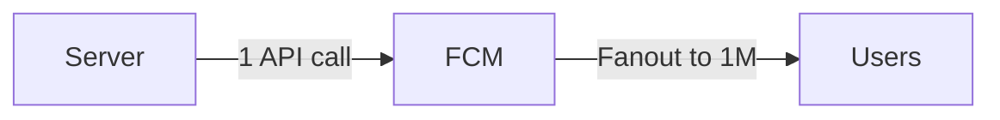
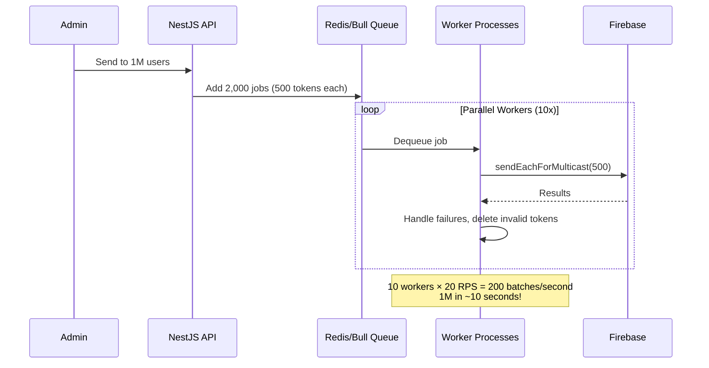
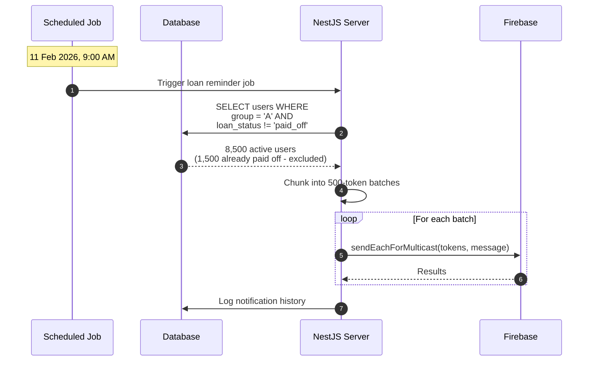
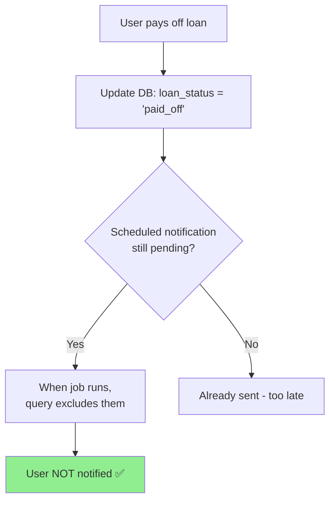

# FCM Questions & Solutions

> Common questions and solutions for the FCM Playground project.

---

## Q1: How to send notifications to 1M users?

### 🚀 Strategies for Sending to 1M Users

---

### Option 1: Topic Messaging (Recommended for Broadcasts)

**Best for**: Same message to all users (announcements, marketing)



**How it works:**
- All users subscribe to a topic (e.g., `all_users` or `promotions`)
- You send **ONE message** to the topic
- FCM handles the fanout to 1M devices automatically

```typescript
// Single API call - FCM does the work
await messaging.send({
  topic: 'all_users',
  data: { title: 'Hello 1M users!' }
});
```

**Limits:**
- Fanout rate: ~10,000/second (100 seconds for 1M)
- Max 1 concurrent fanout per project recommended

---

### Option 2: Multicast + Chunking (For Targeted Messages)

**Best for**: Different messages per user segment, need per-token tracking

```typescript
async sendToMillion(tokens: string[]) {
  const BATCH_SIZE = 500;      // FCM limit
  const DELAY_MS = 50;         // Rate limiting
  const chunks = this.chunkArray(tokens, BATCH_SIZE);
  
  // 1M tokens = 2,000 batches
  for (const chunk of chunks) {
    await this.messaging.sendEachForMulticast({
      tokens: chunk,
      data: { ... }
    });
    
    await this.delay(DELAY_MS); // ~20 batches/second
  }
}
// Estimated time: 2,000 batches / 20 per second = ~100 seconds
```

---

### Option 3: Message Queue (Production Scale)

**Best for**: Reliability, retry handling, rate limiting



**Implementation:**

```typescript
// notifications.queue.ts
@Processor('notifications')
export class NotificationsProcessor {
  @Process('multicast')
  async handleMulticast(job: Job<{ tokens: string[], payload: any }>) {
    const { tokens, payload } = job.data;
    
    const response = await this.messaging.sendEachForMulticast({
      tokens,
      data: payload,
    });
    
    // Handle failures
    response.responses.forEach((res, idx) => {
      if (res.error?.code === 'messaging/registration-token-not-registered') {
        this.deviceService.deleteToken(tokens[idx]);
      }
    });
    
    return { success: response.successCount, failed: response.failureCount };
  }
}
```

---

### 📊 Comparison Table

| Method | API Calls | Time (1M users) | Use Case |
|--------|-----------|-----------------|----------|
| **Topic** | 1 | ~100s (FCM fanout) | Same message to all |
| **Multicast** | 2,000 | ~100s (sequential) | Need token-level tracking |
| **Queue + Workers** | 2,000 | ~10s (parallel) | Production, high reliability |
| **Device Groups** | 1 | Variable | Up to 20 devices/group |

---

### ⚡ Best Practices for 1M Scale

| Practice | Why |
|----------|-----|
| **Use Topics** | 1 API call vs 2,000 |
| **Gradual Ramp-up** | 0→max RPS over 60s |
| **Avoid :00, :15, :30, :45** | FCM peak times |
| **Exponential Backoff** | Handle 429 errors gracefully |
| **Delete Invalid Tokens** | Clean up UNREGISTERED tokens |
| **Use TTL** | Don't deliver stale messages |
| **Collapse Key** | Prevent notification spam |

---

### 🎯 Recommendation

**For broadcasting (same message to all):**
```typescript
// Just use topic!
await messaging.send({ topic: 'all_users', data: {...} });
```

**For targeted/segmented sends:**
```typescript
// Add a queue system (Bull + Redis)
await this.notificationQueue.addBulk(
  chunks.map(tokens => ({
    name: 'multicast',
    data: { tokens, payload }
  }))
);
```

---

## Q2: How to send scheduled notifications to loan groups while excluding paid-off users?

### 📋 Scenario

| Group | Due Date | Notification Date |
|-------|----------|-------------------|
| Group A | Loan payment | 11 Feb 2026 |
| Group B | Loan payment | 15 Feb 2026 |

**Challenge**: Some users in Group A have already paid off their loan → don't send them reminders!

---

### 🏗️ Solution Architecture



---

### 📊 Database Schema

```sql
-- Users table with loan status
CREATE TABLE users (
  id INTEGER PRIMARY KEY,
  name TEXT,
  fcm_token TEXT,
  loan_group TEXT,           -- 'A', 'B', etc.
  loan_status TEXT,          -- 'active', 'partial', 'paid_off'
  loan_due_date DATE,
  notification_enabled BOOLEAN DEFAULT true,
  created_at TIMESTAMP DEFAULT CURRENT_TIMESTAMP
);

-- Scheduled notifications table
CREATE TABLE scheduled_notifications (
  id INTEGER PRIMARY KEY,
  target_group TEXT,
  title TEXT,
  body TEXT,
  scheduled_at TIMESTAMP,
  status TEXT,               -- 'pending', 'sent', 'cancelled'
  exclude_condition TEXT,    -- JSON: {"loan_status": ["paid_off"]}
  created_at TIMESTAMP DEFAULT CURRENT_TIMESTAMP
);
```

---

### 🔧 Implementation

#### 1. Schedule Notification Job (NestJS + Bull)

```typescript
// scheduled-notifications.service.ts
@Injectable()
export class ScheduledNotificationsService {
  constructor(
    @InjectQueue('notifications') private queue: Queue,
    @Inject(DB) private db: DrizzleDb,
  ) {}

  async scheduleGroupNotification(input: {
    group: string;
    title: string;
    body: string;
    scheduledAt: Date;
    excludeStatuses: string[];
  }) {
    // Add job to queue with delay
    const delay = input.scheduledAt.getTime() - Date.now();
    
    await this.queue.add('group-notification', {
      group: input.group,
      title: input.title,
      body: input.body,
      excludeStatuses: input.excludeStatuses,
    }, {
      delay: delay,
      jobId: `loan-reminder-${input.group}-${input.scheduledAt.toISOString()}`,
    });
  }
}
```

#### 2. Process Job at Scheduled Time

```typescript
// notifications.processor.ts
@Processor('notifications')
export class NotificationsProcessor {
  @Process('group-notification')
  async handleGroupNotification(job: Job) {
    const { group, title, body, excludeStatuses } = job.data;
    
    // Query ONLY users who haven't paid off
    const users = await this.db
      .select({ token: users.fcmToken })
      .from(users)
      .where(
        and(
          eq(users.loanGroup, group),
          notInArray(users.loanStatus, excludeStatuses), // Exclude paid_off!
          eq(users.notificationEnabled, true),
          isNotNull(users.fcmToken),
        )
      );
    
    const tokens = users.map(u => u.token);
    console.log(`Sending to ${tokens.length} users (excluded paid_off)`);
    
    // Chunk and send
    return this.sendMulticast(tokens, { title, body });
  }
  
  private async sendMulticast(tokens: string[], payload: any) {
    const chunks = this.chunkArray(tokens, 500);
    let successCount = 0;
    let failureCount = 0;
    
    for (const chunk of chunks) {
      const response = await this.messaging.sendEachForMulticast({
        tokens: chunk,
        data: payload,
      });
      successCount += response.successCount;
      failureCount += response.failureCount;
    }
    
    return { successCount, failureCount };
  }
}
```

#### 3. API to Schedule Reminders

```typescript
// scheduled-notifications.controller.ts
@Controller('scheduled-notifications')
export class ScheduledNotificationsController {
  @Post('loan-reminder')
  async scheduleLoanReminder(@Body() body: {
    group: string;
    scheduledAt: string;
  }) {
    await this.service.scheduleGroupNotification({
      group: body.group,
      title: '💳 Loan Payment Reminder',
      body: `Your loan payment is due today. Please make your payment.`,
      scheduledAt: new Date(body.scheduledAt),
      excludeStatuses: ['paid_off'], // Key: exclude paid off users!
    });
    
    return { message: `Reminder scheduled for group ${body.group}` };
  }
}
```

---

### 📝 API Usage

**Schedule Group A reminder (11 Feb):**
```bash
POST /scheduled-notifications/loan-reminder
{
  "group": "A",
  "scheduledAt": "2026-02-11T09:00:00+07:00"
}
```

**Schedule Group B reminder (15 Feb):**
```bash
POST /scheduled-notifications/loan-reminder
{
  "group": "B",
  "scheduledAt": "2026-02-15T09:00:00+07:00"
}
```

---

### 🔄 Real-time Exclusion Flow



**Key Insight**: Query the database **at send time**, not at schedule time! This ensures users who pay off between scheduling and sending are excluded.

---

### 🎯 Alternative: Topic-based Approach

If groups are static, use FCM topics:

```typescript
// When user joins group
await messaging.subscribeToTopic([userToken], `loan_group_${groupId}`);

// When user pays off loan - unsubscribe!
await messaging.unsubscribeFromTopic([userToken], `loan_group_${groupId}`);

// Send to topic (excludes unsubscribed users)
await messaging.send({
  topic: `loan_group_A`,
  data: { title: 'Payment Reminder', body: '...' }
});
```

---

### 📊 Comparison

| Approach | Pros | Cons |
|----------|------|------|
| **Query at send time** | Always accurate, simple DB query | Requires storing tokens |
| **Topic unsubscribe** | 1 API call to send | Must manage subscriptions |
| **Condition-based topics** | Flexible targeting | Complex conditions limited |

---

### ✅ Recommended Solution

1. **Use database query at send time** for accuracy
2. **Exclude `paid_off` status** in WHERE clause
3. **Use Bull queue** for reliable scheduling
4. **Chunk tokens** into 500-batch multicast calls

<!-- Template for new questions:

## Q#: Question Title

### Problem

Description of the problem...

### Solution

Solution details...

-->
